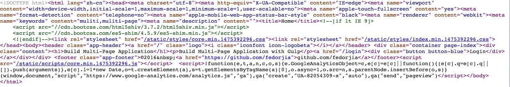
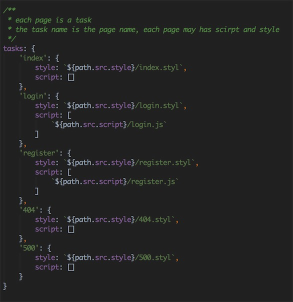

>Use  `gulp` to build multi-page webapp.

# Usage
##install
```
npm install

gulp build

node index.js
``` 
then visit [http://localhost:3000](http://localhost:3000)
view document source code, you will find it.



## configure
edit` build/conf.js` file, and configure your tasks.


## development
when you are developing your app

1.  edit settings.js, change `debug = true`
2.  run the following command

```
gulp dev
```
it will do the following things

* concat each page styles and scripts
* inject them into html

## production
when you are preparing to publish your app

1.  edit settings.js, change `debug = false`
2.  run the following command

```
gulp build
```
it will do the following things

* concat each page styles and scripts
* compress style and script and rename each file with hash suffix.
* inject them into html.

**you can also build single page with the page task, for example:**

index page for development

```
gulp index-dev
```

index page for production

```
gulp index-build
```
